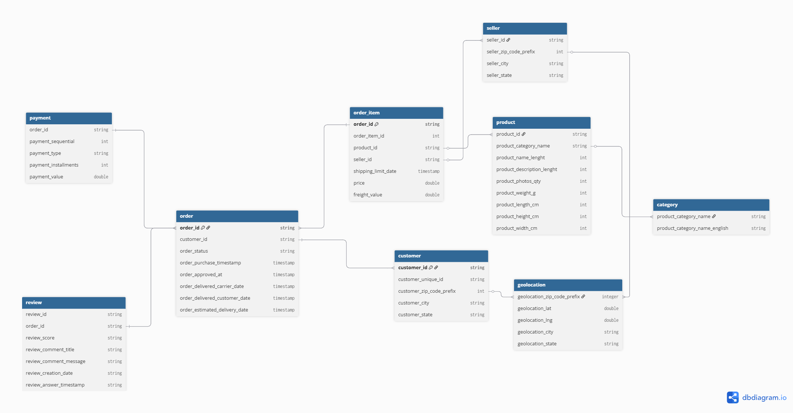

# Brazilian E-Commerce Data Lakehouse

End-to-end Data Lakehouse pipeline xây dựng trên bộ dữ liệu **Brazilian E-Commerce (Olist)** — từ ingestion dữ liệu thô đến mô hình phân tích Star Schema, sử dụng kiến trúc **Medallion (Bronze → Silver → Gold)**.



---

## Kiến trúc hệ thống

```
  ┌──────────┐         ┌──────────────────┐         ┌──────────┐
  │  Azure   │  CSV    │    Databricks    │  Delta  │  Azure   │
  │  Data    │───────▶│    Notebook      │────────▶│  Data    │
  │  Lake    │         │  (Bronze Layer)  │         │  Lake    │
  │ Storage  │         └──────────────────┘         │ Storage  │
  │ Gen2     │                                      │ Gen2     │
  │          │         ┌──────────────────┐         │          │
  │          │         │       dbt        │  Delta  │          │
  │          │         │  (Silver + Gold) │────────▶│          │
  │          │         └──────────────────┘         │          │
  └──────────┘                  ▲                   └──────────┘
                                │
                         ┌──────┴──────┐
                         │   Airflow   │
                         │  (Docker)   │
                         └─────────────┘
```

| Thành phần | Công nghệ | Vai trò |
|------------|-----------|---------|
| **Storage** | Azure Data Lake Storage Gen2 | Lưu trữ dữ liệu (CSV, Delta) |
| **Compute** | Azure Databricks (Unity Catalog) | Engine xử lý dữ liệu |
| **Transform** | dbt-databricks | Transformation Silver & Gold |
| **Orchestration** | Apache Airflow (Docker) | Điều phối pipeline |
| **Format** | Delta Lake | Storage format với ACID transactions |

---

## Cấu trúc dự án

```
.
├── assets/                  # Hình ảnh, tài nguyên tĩnh
│   └── MODEL.png            # Sơ đồ ER dữ liệu gốc
│
├── notebook/                # Databricks Notebooks
│   └── 01_ingest_bronze.ipynb   # Ingestion CSV → Delta (Bronze)
│
├── dbt_ecommerce/           # dbt Project
│   ├── models/
│   │   ├── bronze/
│   │   │   └── sources.yml      # Khai báo source từ Bronze
│   │   ├── silver/
│   │   │   ├── schema.yml       # Schema + tests cho Silver
│   │   │   ├── orders.sql       # Làm sạch đơn hàng
│   │   │   ├── order_items.sql  # Làm sạch chi tiết đơn
│   │   │   ├── payments.sql     # Làm sạch thanh toán
│   │   │   ├── reviews.sql      # Làm sạch đánh giá
│   │   │   ├── products.sql     # Làm sạch sản phẩm
│   │   │   ├── customers.sql    # Làm sạch khách hàng
│   │   │   ├── sellers.sql      # Làm sạch người bán
│   │   │   ├── categories.sql   # Danh mục sản phẩm
│   │   │   └── geolocation.sql  # Tọa độ địa lý
│   │   └── gold/                # Star Schema (Fact + Dim)
│   ├── dbt_project.yml
│   └── profiles.yml             # Gitignored — chứa credentials
│
├── dag/                     # Airflow DAGs
├── doc/                     # Tài liệu
│   ├── MODEL.md             # Data model & Star Schema design
│   ├── DATABRICK SETUP GUIDE.md
│   ├── SETUP.md
│   └── RUN_TUTORIAL.md
│
├── docker-compose.yaml      # Airflow stack (Docker)
├── Dockerfile
├── requirements.txt
└── .gitignore
```

---

## Data Pipeline

### Layer 1 — Bronze (Raw Ingestion)

> **Công cụ:** Databricks Notebook  
> **Input:** CSV files trên ADLS  
> **Output:** Delta tables tại `bambo.bronze.*`

```python
# Đọc CSV từ ADLS → Lưu Delta → Đăng ký External Table trong Catalog
df = spark.read.csv("abfss://ecommerce@duongbambo.../bronze/csv/olist_orders_dataset.csv")
df.write.format("delta").save("abfss://ecommerce@duongbambo.../bronze/delta/raw_orders")
```

**9 bảng Bronze:** `raw_orders`, `raw_customers`, `raw_order_items`, `raw_payments`, `raw_reviews`, `raw_products`, `raw_sellers`, `raw_geolocation`, `raw_categories`

---

### Layer 2 — Silver (Cleaned)

> **Công cụ:** dbt  
> **Input:** `bambo.bronze.*`  
> **Output:** Delta tables tại `bambo.silver.*`

Logic xử lý chính:
- Lọc bỏ records có **khóa chính NULL** (data lỗi hệ thống)
- Giữ lại records hợp lệ về mặt business logic
- Chuẩn hóa tên cột và kiểu dữ liệu

```bash
dbt run --select silver
```

---

### Layer 3 — Gold (Analytics-Ready)

> **Công cụ:** dbt  
> **Input:** `bambo.silver.*`  
> **Output:** Star Schema tại `bambo.gold.*`

Thiết kế theo mô hình **Star Schema** tối ưu cho BI/Reporting:

| Fact Tables | Dimension Tables |
|-------------|-----------------|
| `fact_order_items` | `dim_customers` |
| `fact_orders` | `dim_sellers` |
| `fact_payments` | `dim_products` |
| `fact_reviews` | `dim_geolocation` |
| | `dim_date` |

> Chi tiết thiết kế: [doc/MODEL.md](doc/MODEL.md)

---

## Hướng dẫn chạy

### Yêu cầu

- Python 3.10+
- Azure Databricks workspace (có Unity Catalog)
- Azure Data Lake Storage Gen2
- Docker & Docker Compose (cho Airflow)

### 1. Setup Azure & Databricks

Xem chi tiết tại [doc/DATABRICK SETUP GUIDE.md](doc/DATABRICK%20SETUP%20GUIDE.md)

### 2. Cấu hình dbt

```bash
cd dbt_ecommerce

# Tạo file profiles.yml (đã gitignored)
cat > profiles.yml << EOF
dbt_ecommerce:
  target: dev
  outputs:
    dev:
      type: databricks
      host: <your-databricks-host>
      http_path: <your-sql-warehouse-path>
      token: <your-access-token>
      catalog: bambo
      schema: silver
      threads: 4
EOF
```

### 3. Chạy Bronze Ingestion

Upload notebook `01_ingest_bronze.ipynb` lên Databricks và chạy trên All-purpose Cluster.

### 4. Chạy dbt

```bash
# Kiểm tra kết nối
dbt debug

# Build Silver layer
dbt run --select silver

# Build Gold layer
dbt run --select gold

# Chạy tests
dbt test
```

---

## Dataset
**Nguồn:** [Brazilian E-Commerce Public Dataset (Olist)](https://www.kaggle.com/datasets/olistbr/brazilian-ecommerce)

| Bảng | Mô tả | Số cột |
|------|--------|--------|
| Orders | Đơn hàng và timeline | 8 |
| Order Items | Chi tiết sản phẩm trong đơn | 7 |
| Payments | Giao dịch thanh toán | 5 |
| Reviews | Đánh giá từ khách hàng | 7 |
| Products | Thông tin sản phẩm | 9 |
| Customers | Thông tin khách hàng | 5 |
| Sellers | Thông tin người bán | 4 |
| Geolocation | Tọa độ theo mã bưu điện | 5 |
| Categories | Dịch tên danh mục (PT → EN) | 2 |

---

## Tech Stack

<table>
<tr>
<td align="center"><strong>Azure Data Lake<br/>Storage Gen2</strong></td>
<td align="center"><strong>Azure<br/>Databricks</strong></td>
<td align="center"><strong>dbt</strong></td>
<td align="center"><strong>Apache<br/>Airflow</strong></td>
<td align="center"><strong>Delta<br/>Lake</strong></td>
<td align="center"><strong>Docker</strong></td>
</tr>
</table>

---

## License

This project is for educational purposes only. Dataset provided by [Olist](https://www.kaggle.com/datasets/olistbr/brazilian-ecommerce) under CC BY-NC-SA 4.0.
