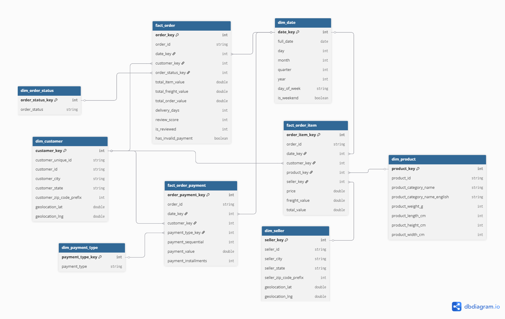

# 📊 Data Model Documentation

## Tổng quan Dataset

Bộ dữ liệu **Brazilian E-Commerce (Olist)** mô phỏng hoạt động thương mại điện tử tại Brazil, bao gồm thông tin chi tiết về đơn hàng, sản phẩm, khách hàng, người bán, thanh toán, đánh giá và tọa độ địa lý.

---

## Mô hình quan hệ (Relational Model — OLTP)


Cơ sở dữ liệu gốc gồm **9 bảng** được tổ chức theo mô hình quan hệ:

| Bảng | Mô tả | Khóa chính |
|------|--------|------------|
| `order` | Trung tâm hệ thống — trạng thái và timeline đơn hàng | `order_id` |
| `order_item` | Chi tiết từng sản phẩm trong đơn (giá, phí vận chuyển) | `order_id` + `order_item_id` |
| `payment` | Giao dịch thanh toán (phương thức, giá trị, trả góp) | `order_id` + `payment_sequential` |
| `review` | Đánh giá từ khách hàng (điểm, bình luận) | `review_id` |
| `customer` | Thông tin người mua (thành phố, bang) | `customer_id` |
| `seller` | Thông tin người bán (thành phố, bang) | `seller_id` |
| `product` | Thông số sản phẩm (kích thước, cân nặng, danh mục) | `product_id` |
| `category` | Bảng dịch thuật tên danh mục (Bồ Đào Nha → Anh) | `product_category_name` |
| `geolocation` | Tọa độ GPS mapping theo mã bưu điện | `geolocation_zip_code_prefix` |

### Mối quan hệ chính

```
order ──┬── 1:N ──→ order_item ──┬── N:1 ──→ product ── N:1 ──→ category
        │                        └── N:1 ──→ seller
        ├── 1:N ──→ payment
        ├── 1:N ──→ review
        └── N:1 ──→ customer

customer ──→ geolocation  (qua zip_code_prefix)
seller   ──→ geolocation  (qua zip_code_prefix)
```

---

## Kiến trúc Lakehouse (Bronze → Silver → Gold)

```
┌─────────────────────────────────────────────────────────────────┐
│                        ADLS Gen2                                │
│  abfss://ecommerce@duongbambo.dfs.core.windows.net/             │
│                                                                 │
│  ┌─────────────┐   ┌─────────────┐   ┌─────────────┐           │
│  │   bronze/    │   │   silver/   │   │    gold/    │           │
│  │  (Raw CSV    │──→│ (Cleaned    │──→│ (Star       │           │
│  │   → Delta)   │   │  Delta)     │   │  Schema)    │           │
│  └─────────────┘   └─────────────┘   └─────────────┘           │
│     Notebook           dbt run           dbt run                │
└─────────────────────────────────────────────────────────────────┘
```

| Layer | Mục đích | Công cụ | Materialization |
|-------|----------|---------|-----------------|
| **Bronze** | Dữ liệu thô từ CSV → Delta | Databricks Notebook | External Table |
| **Silver** | Làm sạch dữ liệu (lọc NULL, chuẩn hóa) | dbt | Managed Table |
| **Gold** | Mô hình phân tích Star Schema | dbt | Managed Table |

---

## Thiết kế Star Schema (Gold Layer)



### Bảng Sự kiện (Fact Tables)

Lưu trữ các giá trị **định lượng** (measures) và khóa ngoại liên kết tới Dimension.

#### `fact_order` — Tổng hợp đơn hàng

Grain: **1 dòng = 1 đơn hàng**.

| Cột | Kiểu | Mô tả |
|-----|------|-------|
| `order_key` 🔑 | int | Surrogate key |
| `order_id` | string | Mã đơn hàng gốc |
| `date_key` 🔗 | int | FK → `dim_date` |
| `customer_key` 🔗 | int | FK → `dim_customer` |
| `order_status_key` 🔗 | int | FK → `dim_order_status` |
| `total_item_value` | double | Tổng giá trị sản phẩm |
| `total_freight_value` | double | Tổng phí vận chuyển |
| `total_order_value` | double | Tổng giá trị đơn hàng |
| `delivery_days` | int | Số ngày giao hàng thực tế |
| `review_score` | int | Điểm đánh giá (1–5) |
| `is_reviewed` | int | Đơn có đánh giá hay không |
| `has_invalid_payment` | boolean | Có giao dịch thanh toán không hợp lệ |

---

#### `fact_order_item` — Chi tiết mặt hàng

Grain: **1 dòng = 1 mặt hàng trong đơn**.

| Cột | Kiểu | Mô tả |
|-----|------|-------|
| `order_item_key` 🔑 | int | Surrogate key |
| `order_id` | string | Mã đơn hàng |
| `date_key` 🔗 | int | FK → `dim_date` |
| `customer_key` 🔗 | int | FK → `dim_customer` |
| `product_key` 🔗 | int | FK → `dim_product` |
| `seller_key` 🔗 | int | FK → `dim_seller` |
| `price` | double | Giá mặt hàng |
| `freight_value` | double | Phí vận chuyển |
| `total_value` | double | Tổng giá trị (price + freight) |

---

#### `fact_order_payment` — Giao dịch thanh toán

Grain: **1 dòng = 1 lần thanh toán**.

| Cột | Kiểu | Mô tả |
|-----|------|-------|
| `order_payment_key` 🔑 | int | Surrogate key |
| `order_id` | string | Mã đơn hàng |
| `date_key` 🔗 | int | FK → `dim_date` |
| `customer_key` 🔗 | int | FK → `dim_customer` |
| `payment_type_key` 🔗 | int | FK → `dim_payment_type` |
| `payment_sequential` | int | Thứ tự thanh toán trong đơn |
| `payment_value` | double | Giá trị giao dịch |
| `payment_installments` | int | Số kỳ trả góp |

---

### Bảng Thứ nguyên (Dimension Tables)

Cung cấp **ngữ cảnh** cho phân tích — trả lời câu hỏi Who, What, Where, When.

#### `dim_customer`

| Cột | Kiểu | Mô tả |
|-----|------|-------|
| `customer_key` 🔑 | int | Surrogate key |
| `customer_unique_id` | string | Mã cá nhân gốc |
| `customer_id` | string | Mã khách hàng theo đơn |
| `customer_city` | string | Thành phố |
| `customer_state` | string | Bang |
| `customer_zip_code_prefix` | int | Mã bưu điện |
| `geolocation_lat` | double | Vĩ độ |
| `geolocation_lng` | double | Kinh độ |

#### `dim_seller`

| Cột | Kiểu | Mô tả |
|-----|------|-------|
| `seller_key` 🔑 | int | Surrogate key |
| `seller_id` | string | Mã người bán |
| `seller_city` | string | Thành phố |
| `seller_state` | string | Bang |
| `seller_zip_code_prefix` | int | Mã bưu điện |
| `geolocation_lat` | double | Vĩ độ |
| `geolocation_lng` | double | Kinh độ |

#### `dim_product`

| Cột | Kiểu | Mô tả |
|-----|------|-------|
| `product_key` 🔑 | int | Surrogate key |
| `product_id` | string | Mã sản phẩm gốc |
| `product_category_name` | string | Tên danh mục (Bồ Đào Nha) |
| `product_category_name_english` | string | Tên danh mục (Tiếng Anh) |
| `product_weight_g` | int | Cân nặng (gram) |
| `product_length_cm` | int | Chiều dài (cm) |
| `product_height_cm` | int | Chiều cao (cm) |
| `product_width_cm` | int | Chiều rộng (cm) |

#### `dim_date`

| Cột | Kiểu | Mô tả |
|-----|------|-------|
| `date_key` 🔑 | int | Surrogate key (YYYYMMDD) |
| `full_date` | date | Ngày đầy đủ |
| `day` | int | Ngày trong tháng |
| `month` | int | Tháng |
| `quarter` | int | Quý |
| `year` | int | Năm |
| `day_of_week` | string | Tên thứ trong tuần |
| `is_weekend` | boolean | Có phải cuối tuần không |

#### `dim_order_status`

| Cột | Kiểu | Mô tả |
|-----|------|-------|
| `order_status_key` 🔑 | int | Surrogate key |
| `order_status` | string | Trạng thái đơn hàng (delivered, shipped, …) |

#### `dim_payment_type`

| Cột | Kiểu | Mô tả |
|-----|------|-------|
| `payment_type_key` 🔑 | int | Surrogate key |
| `payment_type` | string | Phương thức thanh toán (credit_card, boleto, …) |

---

### Mối quan hệ (Relationships)

```
fact_order ──────┬── N:1 ──→ dim_customer
                 ├── N:1 ──→ dim_date
                 └── N:1 ──→ dim_order_status

fact_order_item ─┬── N:1 ──→ dim_customer
                 ├── N:1 ──→ dim_product
                 ├── N:1 ──→ dim_seller
                 └── N:1 ──→ dim_date

fact_order_payment ┬── N:1 ──→ dim_customer
                   ├── N:1 ──→ dim_payment_type
                   └── N:1 ──→ dim_date
```
